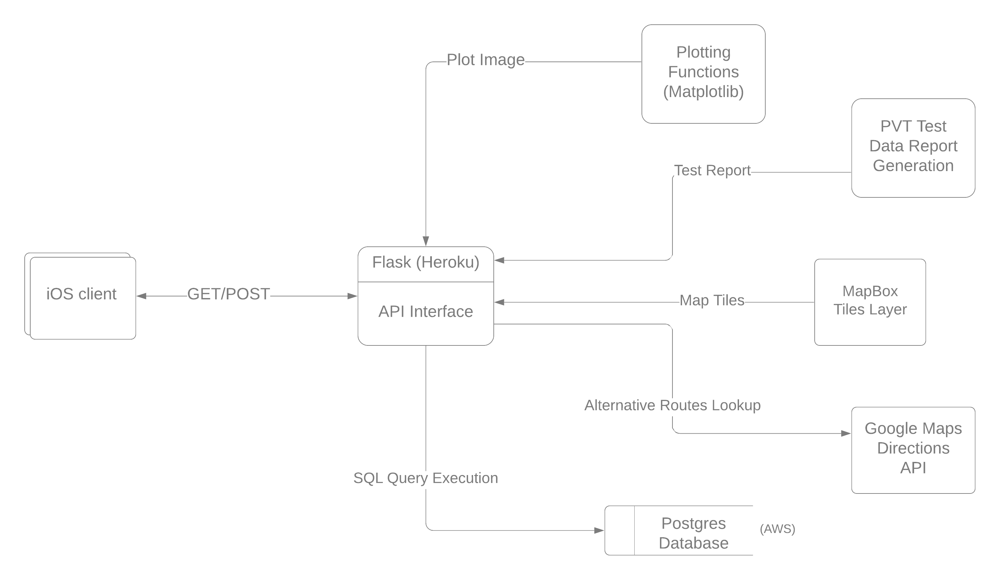

```{r setup, include=FALSE}
knitr::opts_chunk$set(echo = TRUE)
```


# Data processing backend for the FIT5120 Capstone Project

This is the back-end program for of our project titled: Reducing Transport Injuries - Fighting Fatigue
It is developed using the Flask web framework.


## Features

- Implementation of the Psychomotor Vigilance Test (PVT) for measuring fatigue
- Alternative route discovery. Routes are tagged as Safest, Fastest, and Shortest


## System Overview



## Usage

→ Prepare the application

```{r, eval=FALSE}
$ git clone https://github.com/cigarplug/fit5120.git
$ cd fit5120
```


→ Create your heroku application

```{r, eval=FALSE}
$ heroku create <your-app-name>
```


→ Declare environment variables

The vars are stored in the .env file in your app directory

```{r, eval=FALSE}
user : database username
password : database password
host : link to the database host
gcp_key : client key of your Google Maps Directions API project
mapbox_tile : url and access key from your MapBox account
```


→ Run the application on local machine

```{r, eval=FALSE}
$ heroku local
```


To deploy the application, (in your app directory) run:

```{r, eval=FALSE}
$ git push heroku master
```


The application is now deployed. Ensure that at least one instance of the app is running:

```{r, eval=FALSE}
$ heroku ps:scale web=1
```


## API Docs

```{r,echo=FALSE}
tibble::tibble(data.frame(Type = rep("HTTPS POST", 3),
           Location = c("/map", "pvt_data/summary", "pvt_data/chart"),
           Description = c("HTML map: route + accident clusters", 
                           "Fatigue: star rating + description",
                           "Visualization of PVT response times"),
           'Return Type' = c("html", "json", "image/png"),
           check.names = FALSE
           ))
```


For the /map endpoint, the request data is in json format with the following structure:

```{r, eval=TRUE, echo=FALSE, comment=NA}
jsonlite::prettify('{
"origin": {
"qry_type": "txt",
"query": "Melbourne"
},
"dest": {
"qry_type": "latLon",
"query": {
"lat": "-37.8847163",
"lon": "145.0695384",
"address": "Chadstone SC"
}
},
"tags": "safest"
}')
```


For the fatigue test result endpoint i.e, /pvt_data the request json data structure is:

```{r, eval=FALSE, echo=TRUE}
{
  "reaction_times": [0.67, 1.23, 1.07, 1.22, 1.11, 0.7, 1.43],
  "test_times": [5, 10, 8, 8, 6, 9, 5],
  "false_clicks": 3
}
```


